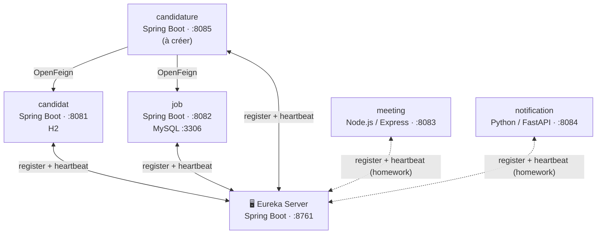

# Workshop 2 – Implémentation du serveur Eureka (Service Discovery)

🎓 **Formation : Microservices**  
📅 **Année universitaire : 2026–2027**  
🧑‍💻 **Workshop 2**

---

## 🎯 Objectif du workshop

L’objectif de ce workshop est de mettre en place un **serveur Eureka** afin de permettre la **découverte dynamique des microservices** dans une architecture distribuée **polyglotte** (Java, JavaScript et Python).

À la fin de ce workshop, l’étudiant sera capable de :

- Comprendre le principe de **Service Discovery**
- Créer et configurer un **Eureka Server**
- Enregistrer des microservices **Spring Boot, Node.js et Python** comme **Eureka Clients**
- Visualiser les instances enregistrées via l’interface Eureka
- Comprendre le mécanisme d’enregistrement et de renouvellement des services (heartbeat)

---

## 🧩 Architecture mise en place

| Microservice | Technologie | Port | Nom dans Eureka | Client Eureka | Statut |
|---|---|---|---|---|---|
| Eureka Server | Spring Boot | 8761 | – | `spring-cloud-starter-netflix-eureka-server` | ✅ fait en séance |
| candidat | Spring Boot | 8081 | `CANDIDAT` | `spring-cloud-starter-netflix-eureka-client` | ✅ fait en séance |
| job | Spring Boot | 8082 | `JOB` | `spring-cloud-starter-netflix-eureka-client` | ✅ fait en séance |
| meeting | Node.js / Express | 8083 | `MEETING` | `eureka-js-client` | 📝 **homework** |
| notification | Python / FastAPI | 8084 | `NOTIFICATION` | `py-eureka-client` | 📝 **homework** |
| candidature | Spring Boot | 8085 | `CANDIDATURE` | `spring-cloud-starter-netflix-eureka-client` | 🚧 à créer par les étudiants |

💡 Eureka est un **annuaire**, pas un proxy : chaque service s’enregistre, envoie un heartbeat toutes les **30 s**, récupère le registre, puis appelle les autres services **directement**. Sans heartbeat pendant **90 s**, Eureka retire l’instance.

---

## 🛠️ Technologies utilisées

- Java 17, Spring Boot, Spring Cloud Netflix Eureka, Maven
- Node.js 18+, Express, `eureka-js-client`
- Python 3.10+, FastAPI, Uvicorn, `py-eureka-client`
- IntelliJ IDEA / VS Code

---

## 📄 Énoncé du workshop

L’énoncé détaillé du Workshop 2 est disponible au format PDF :

👉 [Télécharger l’énoncé du Workshop 2](https://github.com/badi3a/AWD-Training/blob/main/Atelier_Eureka%20server.pdf)

---

## 📝 Travail à faire  – par équipe

Les microservices **Candidat** et **Job** ont été enregistrés dans Eureka pendant la séance.  
👉 Chaque équipe doit maintenant enregistrer les deux microservices **non-Java** dans le même serveur Eureka :

- 1. Microservice Meeting (Node.js / Express)

- 2. Microservice Notification (Python / FastAPI)

### 3. Vérification

Chaque microservice doit :

- Être enregistré automatiquement dans Eureka
- Être visible dans le dashboard (http://localhost:8761)
- Pouvoir être exécuté sur plusieurs instances (ports différents)
- Continuer à répondre sur son endpoint `hello` :
  - `GET http://localhost:8083/api/meetings/hello`
  - `GET http://localhost:8084/api/notifications/hello`

### ⭐ Bonus

- Ajouter un endpoint `GET /health` à meeting et notification et le déclarer comme `healthCheckUrl` / `statusPageUrl` dans Eureka
- Depuis meeting ou notification, **découvrir** l’adresse de `CANDIDAT` via Eureka (pas d’URL en dur) et appeler `GET /api/candidates/{id}`

---

## ✅ Rendu attendu (par équipe)

- Le projet **Eureka Server** fonctionnel
- Les microservices **Meeting** (Node.js) et **Notification** (Python) configurés comme **Eureka Clients**
- Les 4 services (CANDIDAT, JOB, MEETING, NOTIFICATION) visibles en même temps dans le dashboard
- **Au moins deux instances** de MEETING ou de NOTIFICATION visibles (ports différents)
- Une capture d’écran du dashboard Eureka dans le README de l’équipe
- Code structuré et fonctionnel
- Projet poussé sur **GitHub**, avec les noms des membres de l’équipe dans le README

---

## ▶️ Ordre de démarrage

1. Eureka Server – `mvn spring-boot:run` → http://localhost:8761
2. candidat et job – `mvn spring-boot:run`
3. meeting – `npm install` puis `npm start` (2ᵉ instance : `PORT=8093 npm start`, ou `$env:PORT=8093; npm start` sous PowerShell)
4. notification – `pip install -r requirements.txt` puis `python -m uvicorn app.main:app --port 8084`

---

💡 **Conseil :**  
Démarrez d’abord le serveur Eureka avant d’exécuter les microservices clients. Un service peut mettre jusqu’à 30 s avant d’apparaître dans le dashboard.

🚀 Bon courage et bonne implémentation !

---

## 🏫 Cadre pédagogique

### Enseignante : [Badia Bouhdid](https://www.linkedin.com/in/badiabouhdid)

Ce workshop a été développé dans le cadre du module **Applications Web Distribuées**,  
à l’**École d’Ingénieurs ESPRIT**.